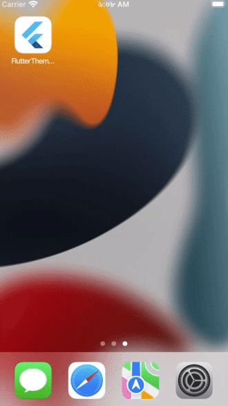

# Flutter Theme Shared Preferences

Storing theme data to local storage using Shared Preferences. 

## Packages used:

</img>
// For providing themeData 
[provider: ^6.0.2](https://pub.dev/packages/provider) 
// For accessing & storing data to local storage 
[shared_preferences: ^2.0.13](https://pub.dev/packages/shared_preferences) 
// For animated switching between day & night mode 
[day_night_switcher: ^0.2.0+1](https://pub.dev/packages/day_night_switcher) 